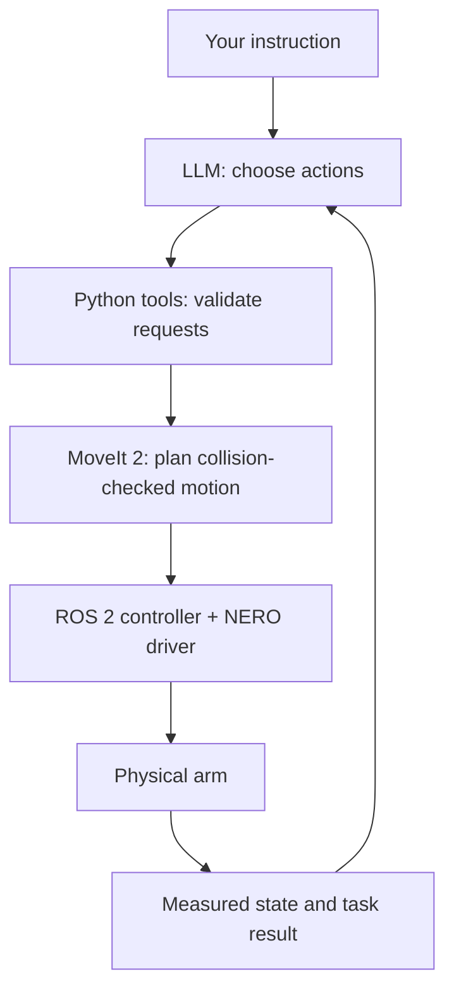

# LLM-directed NERO arm with ROS 2 and MoveIt 2

This project aims to let an AgileX NERO arm carry out natural-language instructions. An LLM chooses actions through a small set of Python tools; MoveIt 2 plans motion; a ROS 2 controller and NERO driver execute it; measured state and task results inform the LLM's next decision.

**Project direction:** use Python for the LLM application and tool validation, ROS 2 + MoveIt 2 for planning and execution, and MuJoCo as an optional physics testing environment.

**Implementation status:** `nero_agent` implements the first named-pose action loop, a ROS 2 Humble / MoveIt 2 backend, and a NERO streaming bridge. It includes the attached standard AgileX gripper model and reads its opening; this first test does not command the gripper. The offline checks pass, but the Docker/ROS integration and physical tracking still require validation. Perception and grasping are future work.

## Try the new experiment

**Normal hardware trajectory execution remains blocked.** An experimental controlled-abort candidate now follows the vendor's MOVE J holding approach, but it has not been physically qualified. Capture, planning, and mock execution remain available. `reviewed_hardware=true` does not remove the block. Historical hardware `--execute` examples below remain blocked.

First, test the application loop with ordinary Python, without ROS, hardware, or an API key:

```bash
python3 -m nero_agent run --offline-demo --output reports/agent-offline.json
```

This uses a test double: it checks action/result plumbing, not collisions or robot motion.

For the real MoveIt planner and ROS controller using mock hardware, build the Humble container and run the deterministic round trip:

```bash
sudo ./scripts/nero_ros2.sh build
sudo ./scripts/nero_ros2.sh demo --scripted --output reports/agent-moveit.json
```

Omit `sudo` if your account already has Docker access. The mock demo runs in a private container network without access to the host CAN interface. It plans a 0.02 rad change in joint 1, executes through the mock ROS controller, verifies feedback, and returns to the captured start. It includes the gripper and an example table in the collision scene. Logs are in `reports/ros2-mock-*.log`; the JSON report records decisions, plans, and results.

To let the LLM choose the actions, set `OPENROUTER_API_KEY` and `OPENROUTER_MODEL` in the repository `.env`, then run:

```bash
sudo ./scripts/nero_ros2.sh demo \
  --instruction "Move to inspection, then return to start." \
  --output reports/agent-llm.json
```

The LLM may choose only configured named poses, observe state, stop, or finish. It receives feedback after each completed action. `--scripted` replaces only the LLM; MoveIt and the ROS controller still run. Omitting it makes real OpenRouter requests. The Docker build context contains only `ros2/`, so the API key is not copied into the image.

The container image has built successfully on the host. The first ROS demo exposed an executor-context startup bug, which has been corrected; a complete ROS round trip and physical execution still require verification. The offline test is not evidence that ROS or hardware execution passed. Docker access from the coding session still requires administrator credentials.

### Mechanically supported hold validation

The controlled-abort path now latches streamed commands off, requests cancellation on the dedicated arm trajectory controller, captures fresh enabled-joint feedback, and sends **one `move_j` target at that measured position**. It never resumes streaming automatically. The driver owns this sequence, so a client error does not prevent its cancellation attempt or hold monitoring.

Cancellation is allowed up to 0.2 seconds; if unavailable, rejected, or timed out, that fact is recorded and the driver still attempts the hold with fresh feedback. Queued controller commands cannot pass the latched gate. Cancellation and physical hold results are separate report fields. The existing velocity guard remains unchanged.

The observer allows up to 5 seconds to settle and requires one continuous second within 0.005 rad of the hold target, below 0.01 rad/s, with fresh enabled feedback. Excursion beyond 0.02 rad, feedback loss, failure to settle, or subsequent loss of holding is reported as a failure. These are observation criteria, not a firmware deceleration guarantee. A failure does **not** automatically invoke damping, disable, reset, or repeatedly chase the moving position. Physical support and operator intervention remain necessary if holding fails.

With the arm mechanically supported against a fall, the workspace clear, and other controllers stopped, the separate validation command is:

```bash
sudo ./scripts/nero_ros2.sh validate-hold nero-agent.local.json \
  --output reports/agent-hold.json
```

This test starts from a stationary pose and prompts for `SUPPORTED HOLD` before sending a position command. It can move the arm during mode entry. It does not enable or reset joints, change gains/speed/acceleration settings, or issue a trajectory. It tests entry into MOVE J holding, **not a JS-to-J transition or an abort during motion**. Passing it does not automatically authorize trajectory execution or mark the controller physically qualified.

During an active stack, `python3 -m nero_agent stop --config nero-agent.local.json` requests the controlled abort. The driver continues observing holding while it remains running. The validation wrapper cleans up its ROS processes after the bounded observation; ongoing monitoring ends then, and the last MOVE J target is left in the controller without disabling/resetting it. This does not establish behavior after communication or power loss.

The old damping stop remains a separate, explicitly invoked ROS service at `/nero/project/emergency_stop` (`std_srvs/srv/Trigger`). It can permit descent and is not an automatic fallback from controlled-abort failure. A kill, lost CAN connection, or power failure cannot be made safe by this Python observer.

### Stationary feedback timing diagnostic

With the arm stationary and supported, and other controllers stopped:

```bash
sudo ./scripts/nero_ros2.sh diagnose-feedback nero-agent.local.json \
  --duration 30 --output reports/agent-feedback-diagnostic.json
```

This standalone ROS timer reads feedback at a requested 100 Hz without starting MoveIt, opening an execution gate, enabling joints, or sending motion/stop commands. Existing feedback freshness limits are unchanged. It records failures as diagnostic data and writes the report after collection, avoiding per-sample log or disk overhead. Duration is bounded to 1–120 seconds. Ctrl-C saves partial samples.

The JSON contains timer intervals, callback and hardware-read durations, joint packet timestamps/ages before and after each read, valid measured states, and read errors. Summary statistics include maxima and 99th percentiles. Long timer intervals with short reads suggest scheduling/executor delays; long reads indicate time spent in the reader, including possible preemption. Old packets even with regular timer callbacks suggest a feedback-delivery problem. These are diagnostic clues, not a definitive root-cause classification.

Timestamp advances are sampled from the SDK cache, not measured directly on the CAN wire; intermediate packets may be missed. This baseline excludes full ROS controller load, and completion means data collection finished—not that feedback or holding passed validation. The diagnostic never takes control of an already moving arm.

For comparison under full idle ROS/MoveIt/controller load, use:

```bash
sudo ./scripts/nero_ros2.sh diagnose-feedback-stack nero-agent.local.json \
  --duration 30 --output reports/agent-feedback-stack.json
```

This starts the normal stack in a dedicated diagnostic mode. Collection starts after readiness, inside the hardware bridge's existing timer and SDK connection. The bridge rejects execution-gate, commissioning, stop, and emergency-stop service requests in this mode, and ignores streamed commands. Keep other controllers stopped and the arm stationary and supported. The test does not enable, disable, reset, or command the arm. It does not actively maintain or verify holding.

Compare `read_errors`, packet ages, `timer_interval_s`, and `read_duration_s` with the standalone report. Full-stack callback duration also includes gripper reads, publication and bridge error logging; `bridge_errors` records failures outside the arm reader as well. During collection this diagnostic also builds a bounded, diagnostic-only trace and polls the actual abort-status service at most 10 times per second. Live replies contain no trace or trace-based calculations. The summary includes request count and maximum response size; `reporting_test.full_trace` contains the report fetched once after collection. This tests the reporting workload without issuing an abort or position command. Full abort reports are unavailable during active observation; normal commissioning also uses compact polling and a final trace fetch. Interrupted full-stack tests record interruption without exporting partial samples. Completion means collection finished, not a safety qualification. No Docker rebuild is needed.

### Supported abort test during motion

Analyze an existing report without ROS or hardware access:

```bash
python -m nero_agent.analyze_abort reports/agent-moving-abort-compact-status.json \
  --output reports/agent-moving-abort-analysis.json
```

The analysis lists each joint's reported peak velocity, nearby positions, and displacement from the holding target. New commissioning traces also retain separate position-packet and motor-velocity timestamps from the checked SDK snapshots, plus the last validated stream command (not a hardware acknowledgement). Older reports lack this timing detail; observation-time differences cannot establish exact instantaneous velocity. Diagnostic metadata does not change stop thresholds or qualify normal execution.

New commissioning reports additionally include per-sample packet ages, packet skew, motion status, controller-command monotonic timestamps, and aggregate maximum age/skew/command-gap metrics. These identify whether a failed hold coincided with delayed CAN feedback or a bridge scheduling gap.

After the stationary hold test succeeds, use the separate, single-use commissioning command:

```bash
sudo ./scripts/nero_ros2.sh commission-abort nero-agent.local.json \
  --output reports/agent-moving-abort.json
```

Use an enabled, stationary arm, mechanically supported against falling while allowing the small test motion. Stop other controllers, clear the workspace, and review the actual tool and collision scene (`reviewed_hardware=true`). The test plans a fixed **+0.01 rad joint1 target** with MoveIt, using 0.02 rad/s and 0.05 rad/s² planning caps. It prompts for **`SUPPORTED ABORT`** before opening a separate restricted gate. No `--execute`, LLM, reset, enable, automatic return, or retry is involved. Repository code is mounted into Docker, so this change needs no image rebuild.

The driver automatically blocks streaming and initiates the MOVE J hold after two advancing feedback samples show at least +0.0005 rad displacement and +0.005 rad/s joint1 velocity. The trial also aborts on a four-second trigger deadline or its tighter measured bounds: 0.03 rad/s, 0.012 rad overall excursion, and 0.002 rad excursion on other joints. These are detection thresholds, not guaranteed physical limits.

The JSON report includes the trigger state, feedback trace, cancellation result, additional travel, and time to sustained standstill. `passed` requires acknowledged controller cancellation, standstill within one second of the trigger, no more than 0.01 rad additional excursion on any joint, and two seconds of fresh enabled holding feedback within 0.002 rad of the hold target and at or below 0.003 rad/s. Exceeding the observed speed bound also fails. `inconclusive` means the deliberate moving abort was not established, including reaching the goal region or completing without a trigger. Failed and inconclusive trials return a nonzero exit code.

This observes one supported trial; it does not guarantee deceleration or unlock normal hardware execution. The gate remains latched, and no damping/disable fallback is added. The wrapper ends monitoring when it cleans up the ROS stack after the test, leaving the last holding target in the controller. Review the report and physical behavior before another trial.

### Hardware capture, planning, and supervised execution

```bash
cp examples/nero-agent.hardware.example.json nero-agent.local.json
sudo ./scripts/nero_ros2.sh capture nero-agent.local.json --output reports/agent-start.json
sudo ./scripts/nero_ros2.sh hardware nero-agent.local.json --scripted \
  --output reports/agent-plan.json
```

Capture reads the arm and attached gripper. The second command plans only the first motion, without opening the execution gate. Both commands start and clean up their own ROS stack. The bridge never automatically enables, resets, or homes the arm. Use the existing isolated hardware setup procedure first; do not run another controller or direct-motion script concurrently.

Before physical execution, review `nero-agent.local.json`: the example table is a placeholder in `base_link` coordinates, `inspection` is a small relative joint target, and the model assumes the standard AgileX gripper. Verify mounting, actual tool geometry, obstacles, joint conventions, and the vendor SRDF collision exclusions. Set `reviewed_hardware` to `true` once that review is complete. Then:

```bash
sudo ./scripts/nero_ros2.sh hardware nero-agent.local.json --scripted --execute \
  --output reports/agent-execution.json
```

Each physical motion requires typing `EXECUTE`. Start with the deterministic test before using LLM choices. A failure ends the sequence without an automatic return or retry. Initial hardware testing must establish tracking and stop behavior; this bridge has not yet been physically validated.

Plans use 0.08 rad/s velocity and 0.15 rad/s² acceleration caps, with a 0.15 rad maximum excursion from the captured start. MoveIt sends the timed trajectory to the ROS2 `joint_trajectory_controller`; the hardware bridge forwards controller position targets through the vendor's ordinary `move_j` position interface. The unsmoothed instantaneous SDK `move_js` interface is not used for trajectory execution. The bridge retains the 0.10 rad/s measured-velocity guard, fresh-feedback checks, tracking bounds, and a command/heartbeat watchdog. It reuses the pinned SDK and firmware-specific acceleration encoding/readback correction. These checks can reject a trajectory; they do not establish physical tracking performance in advance.

After a moving-abort qualification passes, supply that report explicitly for hardware execution:

```bash
sudo ./scripts/nero_ros2.sh hardware nero-agent.local.json --scripted --execute \
  --abort-qualification-report reports/agent-moving-abort-controller-synchronized.json \
  --output reports/agent-execution.json
```

The client verifies the report records a passed commissioning trial, acknowledged cancellation, and sustained powered holding before it opens the execution path. A missing, malformed, or failed report remains blocked.

For an already running stack, use the controlled-abort command described above from the same sourced ROS environment and domain (default `ROS_DOMAIN_ID=73`). Its result distinguishes controller cancellation from observed holding.

For a native Humble environment with the dependencies and pinned vendor packages from [ros2/Dockerfile](ros2/Dockerfile) installed and sourced:

```bash
export ROS_DOMAIN_ID=73 ROS_LOCALHOST_ONLY=1
python3 -m nero_agent doctor
python3 -m nero_agent.bringup --config examples/nero-agent.mock.json --scripted --execute
```

The hardware ROS plugin is `topic_based_ros2_control/TopicBasedSystem`, connected to actual SDK feedback. `mock_components/GenericSystem` is used only for the mock test. The project bridge owns hardware commands; the vendor direct driver is not launched alongside it. MuJoCo is installed in the container because the reused hardware reader imports the old experiment package, but it does not plan or gate these motions.

## Target architecture



The control loop is: observe the current state, select one action, validate and plan it, execute it, then report the measured result. The LLM does not schedule motor commands, solve inverse kinematics, or assume that a requested motion succeeded.

## Responsibilities

| Layer | Responsibility |
| --- | --- |
| LLM | Interpret the instruction, choose an available action, and decide what to do after receiving its result. |
| Python tools | Validate action names and arguments, enforce workspace/task constraints, manage task state, and return structured results. |
| MoveIt 2 | Use the current robot state and planning scene to solve motion goals, check collisions, and produce trajectories with configured velocity and acceleration limits. |
| ROS 2 controller + NERO driver | Execute the planned trajectory, expose measured state and execution status, and support cancellation and fault handling. |
| Perception and transforms, added later | Locate objects, maintain scene geometry, and transform measured poses into known robot frames. |
| MuJoCo, optional | Test physics, contact, grasping, and repeatable simulated scenarios when those capabilities are needed. |

Python remains the application language. MoveIt provides a [Python planning API (`moveit_py`)](https://moveit.picknik.ai/main/doc/examples/motion_planning_python_api/motion_planning_python_api_tutorial.html). AgileX provides a [NERO-compatible ROS 2 and MoveIt integration](https://github.com/agilexrobotics/agx_arm_ros/blob/ros2/src/agx_arm_moveit/README_EN.md), including a `FollowJointTrajectory` interface through `ros2_control`. The new backend uses MoveIt ROS services/actions from Python and the vendor robot description, with a project hardware bridge. Their physical behavior on this arm remains to be verified.

Only the selected execution backend should command the physical arm. The LLM and application tools must not bypass it through direct CAN or SDK calls. Existing direct-control scripts must not run alongside the ROS 2 motion controller.

## Python action interface

Start with a small set of tools backed by deterministic implementations:

| Tool | Purpose |
| --- | --- |
| `get_state()` | Return fresh measured joint state, robot status, and whether an action is active. |
| `move_to_named_pose(name)` | Plan and execute a motion to a reviewed pose, starting from the measured state. |
| `stop()` | Request cancellation/stop through the execution layer and report the observed outcome. |

The implemented action contract also includes `finish`. A request looks like:

```json
{
  "action": "move_to_named_pose",
  "pose": "inspection",
  "reason": "Inspect the reviewed pose"
}
```

Each action should return its identifier, completion/failure status, reason, and latest measured state. Planning success, command acceptance, and physical completion are distinct outcomes. The next LLM decision should use physical feedback, not the last requested pose or simulated prediction.

Allow one motion action at a time, with bounded execution time and explicit cancellation. Reject unknown tools, malformed arguments, unavailable poses, and stale state. A fault or cancellation ends the current motion sequence; it must not trigger an automatic return or blind retry.

Later, add pose and object-based tools such as `move_to_pose(...)`, `move_above(object_id, clearance_m)`, `pick(object_id)`, and `place(location_id)`. Object-based actions require perception, calibrated coordinate transforms, and grasp/task logic. The LLM may select an object identifier; the application resolves its measured position. [MoveIt Task Constructor](https://moveit.picknik.ai/main/doc/tutorials/pick_and_place_with_moveit_task_constructor/pick_and_place_with_moveit_task_constructor.html) is a candidate for staged manipulation skills.

## Migration milestones

### 1. Establish the NERO ROS 2 planning environment

- Select and document a ROS 2/MoveIt release supported by the vendor integration and host environment.
- Bring up the vendor NERO model and MoveIt demo without hardware motion.
- Verify the seven joint names, joint conventions, limits, base/tool frames, and actual tool geometry.
- Add the table and known obstacles to the planning scene.

**Acceptance:** a deterministic goal can be planned and previewed against the reviewed model and scene. No LLM is involved.

### 2. Execute one verified motion from Python

- Connect measured NERO feedback to the planning and execution stack.
- Plan a small motion from the current physical state and execute it under supervision.
- Check measured tracking, final pose, timeouts, cancellation, and fault handling.
- Verify that the driver follows the planned timing and that speed/acceleration settings have the intended physical effect.

**Acceptance:** one Python action reliably reports physical completion or a specific failure. Repeatedly splitting a trajectory into independent stop-and-settle SDK commands is not the target execution design.

### 3. Connect the LLM to the working tools

- Expose state, named-pose motion, and stop tools with strict request validation.
- Execute one action and return measured feedback before requesting the next decision.
- Test instructions such as “move to the inspection pose, then return to the start.”
- Log instructions, tool calls, plans, measured results, and rejection reasons.

**Acceptance:** the LLM completes simple multi-action instructions and handles a rejected action without bypassing validation or issuing uncontrolled retries.

### 4. Add perception and manipulation

- Calibrate cameras and robot coordinate transforms.
- Track objects and update planning-scene obstacles from observations.
- Add reusable approach, grasp, lift, and place skills, with appropriate end-effector feedback.
- Evaluate task success using observations and measured state.

**Acceptance:** an object-based instruction can be resolved into verified actions and its result can be observed.

### 5. Expand simulation where it helps

Use MuJoCo for contact-rich tasks, grasp experiments, synthetic observations, and repeatable regression scenarios. Where practical, use the same application tool contracts for simulated and physical backends. Simulation is optional for the first ROS 2 motion milestone.

## Role of simulation and execution checks

The original idea of testing motion in simulation remains useful. A simulation pass alone does not establish how the physical arm will move: model geometry, calibration, payload, controller behavior, and feedback timing all matter.

The current experimental executor validates a timed MuJoCo trajectory but executes separate controller-interpolated `move_j` microsteps. That does not preserve the simulated timing. The new architecture is designed to validate the complete path from a MoveIt plan through controller execution to measured motion.

MoveIt can provide [trajectory timing and optional jerk-limited smoothing](https://moveit.picknik.ai/main/doc/examples/time_parameterization/time_parameterization_tutorial.html), but the configured driver must faithfully execute the result. A preview in RViz is not a physics simulation or a physical tracking test. MuJoCo adds physics testing where needed; it is no longer the required planner or hardware execution gate.

Retain physical emergency stop, bounded motion, fresh-state checks, fault monitoring, and supervised initial execution. Planned limits and software monitoring do not replace physical safeguards. A stop must not automatically disable motors or reset the controller, since either can change how the arm is supported.

The vendor ROS integration uses pyAgxArm, so changing frameworks does not automatically resolve SDK/firmware issues. Existing findings about feedback freshness and acceleration command units must be checked in the ROS driver path. The project ROS bridge reuses the experimental adapter’s pinned-SDK checks and acceleration compatibility fix before opening its command gate; it does not rely on the vendor driver to install that correction.

## Current implementation and reuse

| Existing component | Status and role during migration |
| --- | --- |
| `nero_planner` | Custom MuJoCo IK, trajectory validation, and kinematic playback. Retain as an offline reference; MoveIt is the target motion planner. |
| `nero_experiment` | Experimental OpenRouter action selection and upright/return execution. Reuse structured-output validation and reporting ideas; replace its motion backend for the new application. |
| `models/nero` and model preparation scripts | Official-URDF-derived MuJoCo assets. Retain for optional simulation and model comparison. |
| `nero_safety_common.py`, `control_nero.py`, and hardware utilities | Direct SDK/CAN utilities. Retain for isolated diagnostics and recovery, outside concurrent ROS execution. |
| `nero_experiment/sdk_compat.py` | Project-local acceleration encoding/readback correction for the reviewed SDK and NERO firmware. Preserve the tests and hardware findings during driver integration. |
| `tests/` and execution reports | Existing offline checks and diagnostic evidence. Extend with ROS integration and measured execution checks during migration. |

The ROS backend and named-pose LLM loop now live in `nero_agent/`, with bringup in `ros2/`. The milestones above describe acceptance criteria, not completed hardware validation. The next validation step is the containerized MoveIt mock round trip, followed by **one supervised, measured NERO motion**. Camera-based object skills remain unimplemented.

## Existing experimental workflows

The sections below document the current implementation for reproducibility and diagnostics. They are not setup instructions for the target ROS 2 architecture. Their `--execute` commands still use direct SDK/CAN control, not MoveIt. Use the new commands above for the ROS 2 path.

## Preparing the MuJoCo environment

The official NERO source is [AgileX's `agx_arm_urdf` repository](https://github.com/agilexrobotics/agx_arm_urdf). It provides the NERO URDF/Xacro files and meshes. The repository is fetched into an ignored directory; no vendor copy is committed here.

Create an isolated environment and install the simulation dependencies:

```bash
python3 -m venv .venv
source .venv/bin/activate
python -m pip install --upgrade pip
python -m pip install -r requirements-mujoco.txt
```

Fetch the official NERO URDF plus its Piper-style gripper and rewrite mesh paths for standalone MuJoCo loading:

```bash
python scripts/prepare_nero_mujoco.py
python scripts/check_mujoco_model.py
```

The checker must report a loaded model and the NERO plus gripper joint list. The default preparation merges the official gripper files directly. If you prefer ROS Xacro expansion, install the ROS `xacro` command and run:

```bash
python scripts/prepare_nero_mujoco.py --xacro
python scripts/check_mujoco_model.py
```

Build and view the first interactive scene with a table and one position actuator per NERO joint:

```bash
python scripts/build_nero_scene.py
python -m mujoco.viewer --mjcf=models/nero/nero_scene.xml
```

The actuators are conservative position actuators for simulation inspection only; they are not connected to `pyAgxArm` and cannot move the physical arm. The scene includes the official Piper-style gripper and a fixed red apple on the table. Gravity is disabled and detailed meshes are visual-only. Padded boxes provide planning collision geometry; the vendor dynamics are not calibrated. The raw viewer's control sliders are for inspection, not validated execution.

## Running the simulation-only executor

After preparing the URDF, rebuild the scene to add the planning geometry and tool site:

```bash
source .venv/bin/activate
python scripts/build_nero_scene.py
python -m nero_planner --demo
python -m nero_planner --target examples/reach.json --output /tmp/nero-trajectory.json
python -m nero_planner --demo --viewer
```

On macOS, launch viewer playback with MuJoCo's `mjpython` launcher instead of `python`:

```bash
mjpython -m nero_planner --demo --viewer
# Or explicitly use the virtual environment's launcher:
.venv/bin/mjpython -m nero_planner --demo --viewer
```

MuJoCo installs `mjpython` with its macOS package. It satisfies the main-thread rendering requirement of `launch_passive` ([MuJoCo documentation](https://mujoco.readthedocs.io/en/stable/python.html#passive-viewer)). Model preparation and headless execution still use ordinary `python`; no scene rebuild is needed for this launcher error.

If the executor reports `Required model element is missing: gripper`, your generated scene is outdated or was prepared without the gripper. Generated models are Git-ignored, so pulling new code does not update them. Run `python scripts/prepare_nero_mujoco.py` without `--no-gripper`, then `python scripts/build_nero_scene.py`, and retry the executor. The error includes the exact scene path being loaded; a custom `--scene` must also be regenerated.

Without `--viewer`, execution is headless kinematic playback. With it, the viewer replays the same quintic joint path in real time and closes at completion. Neither mode steps actuator dynamics. Successful commands print a JSON summary with the achieved pose and validation metrics. Rejected requests print a JSON reason to stderr and exit with status 2. `--output` writes the complete trajectory and achieved pose after successful execution; this report is not an executable hardware command or an importable validation token.

`--start path.json` supplies a JSON array of seven joint angles in radians, ordered `joint1` through `joint7`. The default is the all-zero configuration, with all three gripper joints explicitly synchronized to fully open. The demo moves the grasp center 2 cm in base +X and 2 mm in base -Z, preserving orientation. `examples/reach.json` is an equivalent fixed target for the default starting pose.

The target interface accepts `frame`, `position_m`, `orientation_xyzw`, optional `gripper`, and optional text `reason`. Only `frame="nero_base"` and `gripper=1.0` are supported in this milestone. A quaternion must be finite and unit length within 0.001; small roundoff is normalized, and opposite quaternion signs are equivalent. Unknown fields, unsupported frames, nonfinite numbers, and gripper movement requests are rejected.

The controlled `grasp_center` site is the midpoint of the two finger joint origins at zero opening, using the gripper-base orientation (+Z approach direction). It lies 0.138 m along the vendor gripper-base +Z axis. The fixed transform is derived from the compiled URDF, including the flange attachment, and the site is attached to `link7`. In the zero arm pose it is approximately `[0, 0, 0.89301]` metres in `nero_base`. This convention is a model tool frame, not a measured physical TCP calibration.

### Planning and validation defaults

`--limits path.json` accepts a JSON object overriding fields of `nero_planner.Limits`. Defaults are:

| Setting | Default |
| --- | --- |
| Forbidden-pair clearance | 0.03 m |
| Maximum joint velocity | 0.2 rad/s |
| Maximum joint acceleration | 0.5 rad/s² |
| Maximum per-joint displacement per request | 0.25 rad |
| Maximum target translation per request | 0.05 m |
| Final position/orientation tolerances | 0.002 m / 2° |
| Maximum execution duration | 15 s |
| Playback sample period | 0.02 s |
| Maximum clearance subdivision depth | 16 |
| Maximum validation samples / trajectory samples | 20,000 each |
| Maximum IK iterations | 400 |

These are simulation defaults, not calibrated NERO hardware limits. For example, `{"max_velocity_rad_s": 0.1}` halves the allowed velocity. Joint-position bounds come from the imported model. The planner uses the current simulated joint configuration as the numerical IK seed and applies damping, joint bounds, and a small posture preference. Failure to converge within bounded joint motion is rejected; it does not search alternative routes around obstacles.

The joint path uses `s(u) = 10u³ - 15u⁴ + 6u⁵`, with duration chosen from the exact peak velocity and acceleration of that polynomial. Every configuration stays between its endpoints in joint space. A `ValidatedTrajectory` carries immutable tuples of joint names, positions, timestamps, target pose, captured starting state, validation metrics, and limits. Planning restores the original simulator state. Playback accepts only an unmodified trajectory issued by that planner and rechecks the complete starting joint state, zero velocity, scene fingerprint, and limits. Load a new planner after editing a scene; re-plan after the arm state changes.

### Collision geometry and explicit exclusions

Every imported robot mesh is enclosed by an oriented box padded by 3 mm on each side. A box also encloses the fixed apple and stem with 3 mm padding. The example table top is at `z=-0.05 m`, 5 cm below the robot base reference plane. The viewer executor hides proxy group 3 by default; enable that group in the viewer to inspect the boxes. Tests verify that the boxes contain every mesh vertex at multiple arm poses.

Validation queries MuJoCo forward kinematics and evaluates all forbidden box pairs, including separated pairs without contacts. It uses the 15 separating axes for oriented boxes to obtain a conservative distance lower bound. This avoids the documented positive-distance limitations of some colliders in older MuJoCo releases ([MuJoCo 3.2 API reference](https://mujoco.readthedocs.io/en/3.2.5/APIreference/APIfunctions.html#mj-geomdistance)). The reported clearance is a certified lower bound, not an exact closest-point distance.

At each interval midpoint, validation subtracts a conservative bound on both geometries' possible motion over the interval. If the remaining distance exceeds the configured clearance, the entire interval is certified. Otherwise it bisects the joint interval, rejecting on a clearance violation or an exhausted depth/sample budget. Checking only endpoints or `data.ncon` is insufficient.

The explicit structural exclusions in `nero_planner/model.py` are:

- Geometries rigidly attached to the same robot body.
- Adjacent arm-body pairs (`world/link1`, `link1/link2`, through `link6/link7`) and gripper housing/finger pairs (`link7/gripper_link1`, `link7/gripper_link2`).
- The compact shoulder assembly `world/link2` and wrist assembly `link5/link7`, whose enclosing boxes overlap across an intermediate joint body.
- The fixed base proxy against the table and tabletop; environment/environment contacts are also outside robot-motion validation.

All other robot/table, robot/apple, and robot/robot pairs must maintain clearance, including finger/finger pairs. Additional fixed box obstacles with collision enabled are checked too. Unsupported non-box collision shapes or movable obstacles are rejected at load time. **Excluded assembly pairs are not collision-checked**, even if a configuration could produce a real collision within that assembly. These explicit model limitations must be reviewed, and proxy geometry refined as necessary, before any hardware use. No grasp contacts are permitted.

### Offline acceptance tests

```bash
python -m unittest discover -s tests -v
```

This builds an isolated scene from the prepared URDF and tests successful reaching, mesh enclosure, tool/gripper conventions, table/apple/self-collision rejection, near misses without forbidden contacts, unsafe path interiors with safe endpoints, validation-budget exhaustion, pose/step/timing limits, malformed inputs, stale states/scenes, and modified trajectory rejection. It requires neither CAN nor a display. The root-level `test_nero.py`, `test_backend.py`, and related scripts are existing hardware utilities and are not part of this offline suite.

These tests cover the existing MuJoCo implementation only. They do not validate the planned ROS 2 backend or physical trajectory tracking; new development follows the migration milestones above.

## Existing OpenRouter experiment: upright and return

`nero_experiment` implements this sequence:

```text
Capture all seven measured joint angles, motor and arm-status feedback
→ Generate bounded, reachable Cartesian waypoint options toward an upright reference
→ Gemini selects the next pose using the task, initial observation and simulated state
→ Validate the selected pose and its complete joint path, then simulate it
→ Repeat until upright; validate and simulate the exact reverse joint path
→ Optionally preview the whole round trip
→ For --execute: check hardware motion envelopes and fresh measured state
→ Operator types EXECUTE
→ Small, slow move_j commands with feedback checks and settling after every move
→ Verify return to the original measured joint configuration
```

**“Upright” means straightening the arm to a reviewed joint reference.** The simulation default is all seven joints at zero. Verify that reference on your NERO before physical use. If already at that reference, the experiment reports success without issuing motion or calling the LLM.

The LLM is a pose selector. Local forward kinematics and path validation generate reachable choices; Gemini returns a candidate ID, its Cartesian coordinates, quaternion and a reason. Unknown candidates, changed coordinates, malformed JSON, refusals and exhausted retry budgets fail closed. This avoids depending on an LLM to invent geometrically reachable coordinates or solve redundant-arm IK. `Planner.plan_joint_goal` preserves the exact selected joint posture, including for the return leg.

All LLM calls and round-trip simulation happen **before any physical motion**. The prompt explicitly distinguishes the initial measured observation from subsequent predicted simulation states. No claim is made that the arm was re-observed after each LLM call. The hardware must still match its captured starting state after planning, preview and confirmation. The return path is deterministic; faults stop execution instead of attempting an automatic return through an uncertain state.

The default model is **`gpt-5.6-luna`**. Verify this identifier against the [OpenRouter model catalog](https://openrouter.ai/api/v1/models) before use; unsupported IDs or schema support are errors, with no model substitution. Requests use [strict structured outputs](https://openrouter.ai/docs/guides/features/structured-outputs), followed by independent local validation. `--model` overrides the ID. `OPENROUTER_API_KEY` is loaded from the project-root `.env` or the process environment, with the process environment taking precedence. Task text, arm state, candidate poses and validation metrics are sent to OpenRouter. No camera images are sent. The default outward budget is three pose requests, with at most three LLM attempts per request; `--max-steps` can raise the limit up to 64. HTTP failures abort immediately. Each request has a 60-second timeout and a 4,096-token output cap; timeout/failure details are printed in the rejected report. API usage is billable.

### Setup on the Ubuntu machine connected to the arm

From the repository root:

```bash
python3 -m venv .venv
source .venv/bin/activate
python -m pip install -r requirements-hardware.txt
python scripts/prepare_nero_mujoco.py
python scripts/build_nero_scene.py
python -m unittest discover -s tests -v
mkdir -p reports
```

The hardware requirements install AgileX's `pyAgxArm` directly from its [official GitHub repository](https://github.com/agilexrobotics/pyAgxArm), because it is not available from the Python package index. Git must be installed for this step. The adapter requires SDK version `1.0.0`, checked when connecting; its aggregate joint getter can contain partially stale data, so this adapter deliberately inspects all four constituent joint packets. If the upstream Git repository changes to another version, review that integration before using it. The existing `nero_safety_common.py` selects NERO firmware `V121`; the actual controller firmware must match the reviewed setup.

Configure the existing SocketCAN adapter as appropriate for your server. For the default `can0` at 1 Mbit/s:

```bash
sudo ip link set can0 up type can bitrate 1000000
export NERO_CAN_INTERFACE=socketcan
export NERO_CAN_CHANNEL=can0
```

Put `OPENROUTER_API_KEY=...` in a project-root `.env` file, or export it in the shell. The experiment loads `.env` automatically; an already-exported shell value takes precedence. `.env` is git-ignored. Simulation alone needs only `requirements-mujoco.txt`. Use the offline smoke test first; it neither connects to CAN nor calls OpenRouter:

```bash
python -m nero_experiment run --offline-demo --output reports/offline.json
```

This uses a slightly bent simulated arm, four outward steps and four return steps. Add `--viewer` for continuous visual playback, including a short pause at upright. Ubuntu needs a working display for the viewer; on macOS use `.venv/bin/mjpython -m nero_experiment ... --viewer`. All other commands can run headlessly over SSH.

### Capture state and test Gemini without movement

This experiment reads and moves the NERO arm only. It neither initializes nor commands an effector, and it does not require gripper feedback. The MuJoCo scene still contains the AGX gripper as passive collision geometry and uses its modeled grasp-center frame for Cartesian candidate generation; review that geometry against the actual tool setup before physical use.

Capture a stationary state without enabling, resetting, disabling or moving the arm:

```bash
python -m nero_experiment capture --output reports/start.json
```

Test Gemini and the complete simulation from that saved state:

```bash
python -m nero_experiment run \
  --start reports/start.json \
  --output reports/gemini-simulation.json
```

Or capture fresh hardware feedback and simulate in one command:

```bash
python -m nero_experiment run \
  --read-hardware \
  --output reports/live-state-simulation.json
```

These commands issue no motion commands. They also do not auto-enable the arm. Healthy, disabled joints can be captured; physical execution requires all seven joints already enabled and the controller reporting NORMAL. Standby/CAN control modes are supported; teaching and other control sources are rejected. For simulation with another known upright reference, supply `--upright path.json` containing seven joint angles in radians.

Successful reports contain `status: "simulation_passed"`, a `scene_fingerprint`, every LLM decision, the captured state and all simulated trajectories. These files are reports, **not executable trajectory approvals**. Hardware execution always captures and plans anew in the same process. Simulation success does not imply hardware envelope checks will pass.

### Review the physical setup before --execute

Copy the example configuration:

```bash
cp examples/upright-hardware.example.json upright-hardware.local.json
```

Complete its fields after checking the actual installation:

- `scene_fingerprint`: copy from the dry run **after** reviewing the scene against the real table, robot mount, tool, payload and obstacles. The default scene includes an example table/apple; it does not observe your surroundings. Rebuild and review when geometry changes.
- `upright_joints_rad`: a verified upright posture in SDK joint order/radians. Check joint signs, zero offsets and the model against measurements at multiple configurations; all-zero is an initial model convention.
- `flange_position_in_link7_m` and `flange_orientation_in_link7_xyzw`: the calibrated transform from the model's `link7` frame to the SDK-reported flange frame. The example identity transform is a placeholder, not a calibration. The adapter compares model and measured flange poses before movement and after every settled microstep, rejecting differences above 5 mm or 3 degrees. Agreement at one pose is not sufficient calibration.
- The five verification booleans must reflect completed checks: firmware, joint conventions, upright reference, tool/scene, and tested physical emergency stop. Strings such as `"true"` are rejected. Review the documented structural collision exclusions; they still apply.

Keep the workspace clear, supervise the first experiment and have the physical emergency stop accessible. Manually enable the supported arm through your established procedure. This program preserves motor enable state on normal exit and sends an electronic emergency stop on an execution fault; it does not reset faults or automatically disable motors, which could release the arm.

First include the reviewed configuration in a dry run. This also checks calibration and all independent-joint motion envelopes:

```bash
python -m nero_experiment run \
  --read-hardware \
  --hardware-config upright-hardware.local.json \
  --output reports/hardware-preflight.json
```

Then explicitly request physical execution:

```bash
python -m nero_experiment run \
  --read-hardware \
  --hardware-config upright-hardware.local.json \
  --execute \
  --output reports/execution.json
```

The operator must type `EXECUTE` after successful simulation and preflight. Any other response cancels. The state is checked again after that prompt. There is no noninteractive bypass; `--offline-demo` cannot be combined with physical execution.

### Execution bounds and limitations

| Check | Initial experiment setting |
| --- | --- |
| LLM pose-request budget | At most 3 outward requests by default (`--max-steps` can override) |
| Validated waypoint size | At most 1.0 rad per joint / 0.5 m |
| Simulated velocity / acceleration | 0.08 rad/s / 0.15 rad/s² |
| Maximum simulated segment duration | 30 s |
| Maximum start-to-upright joint excursion | 3 rad per joint |
| Controller speed setting | 1% |
| Controller joint acceleration cap | 0.15 rad/s², or the lower simulated/existing joint limit; verified before motion |
| Nominal hardware microstep | At most 0.002 rad per joint; each waypoint is split into these slow commands |
| Hardware start mismatch | At most 0.001 rad |
| Position tolerance for settling | 0.0005 rad for at least 0.3 s |
| Certified tracking envelope | Endpoint joint bounds expanded by 0.002 rad |
| Required collision clearance | 0.005 m throughout each checked envelope |
| Joint packet age / inter-packet skew | At most 50 ms / 20 ms |
| Other feedback packet age / overall skew | At most 250 ms / 150 ms |
| Motor velocity trip threshold | 0.10 rad/s; joint finite-difference cross-check at 0.11 rad/s |
| Polling period | 20 ms, subject to OS and SDK scheduling |
| Per-microstep / whole execution timeout | At least 5 s per step / 1,200 s overall |

The three-request default reduces LLM cost by choosing larger prevalidated waypoints. It does not raise the simulated speed or acceleration limits: those remain 0.08 rad/s and 0.15 rad/s². `move_j` performs controller-side interpolation, not the exact quintic timing seen in simulation. The adapter splits each waypoint into at most 0.002 rad joint microsteps, uses a 1% controller speed setting, and settles each command from measured feedback. It certifies a whole joint-angle box for each microstep, including a tracking margin: every combination of joint positions within that box has the required modeled clearance. This accounts for differing joint timing. The upright experiment uses a 5 mm minimum clearance so closer modeled link pairs can pass; this is a small model-based margin and can still be less than the collision-proxy model error. Review the geometry against the real setup before any physical execution. Conservative geometry-motion bounds can still reject a move even when a line-path simulation passes. A run may reject the three-waypoint plan if any large segment cannot be certified within the configured joint, translation, clearance or duration limits.

The monitor checks fresh joint, motor, driver and arm-status feedback; bounds joint position and measured speed; and waits for measured arrival, not just an idle flag. Before a command, joint age/skew failures reset the settling dwell and are resampled within the existing 5-second stationary timeout. Every accepted joint snapshot must still meet the 50 ms age / 20 ms skew limits. During an active move, timing failures still abort immediately. Timing errors include individual packet ages and skew; controller/driver faults are not retried by the stationary check. Execution report updates reuse serialized trajectories to reduce interference with the SDK receiver thread. A fault, timeout, stale packet, tracking deviation or Ctrl-C during execution triggers a best-effort electronic stop and cancels the remaining outward/return commands. Reports record the measured state and goal before each command and the achieved state after settling; an aborted report explicitly indicates that physical motion may have occurred. A motor or finite-difference velocity trip also records a `velocity_limit_exceeded` event with the source, joint, threshold, goal, elapsed command time, and up to 26 recent feedback snapshots (roughly 0.5 seconds at nominal polling, including the offending sample). Snapshots contain joint positions, motor velocities and packet timestamps. The buffer stays in memory during motion; serialization and report writing happen only after the electronic stop has been attempted, including when stop delivery fails. Diagnostic report failures do not replace the original motion/stop error.

This Python process is not a real-time safety controller. Polling can miss between-sample deviations, CAN/software stops can fail, and process termination or power loss can prevent cleanup. The simulator does not validate real acceleration, stopping distance, payload dynamics or controller tracking. Full extension can be singular; a controller singularity status aborts the experiment rather than forcing the last move. Physical validation, refined collision exclusions and an independent stop remain necessary. Automated motion tests use fake feedback. The corrected acceleration setup has also been checked on a physical NERO 1.21 without sending motion commands; all seven joints read back 0.15 rad/s² (see `reports/acceleration-setup-verified-20260916.json`). This does not validate trajectory tracking during physical execution.

The 0.002 rad microsteps may reduce transient motion peaks but do not enforce acceleration or guarantee compliance with the velocity trip threshold. They increase the command count and execution time; the 2,000-command and 1,200-second limits remain in force. The SDK accepts integer speed percentages, so a fractional ramp between 0% and 1% is unavailable. After EXECUTE confirmation, the experiment lowers controller joint acceleration limits to at most 0.15 rad/s² (or the lower simulated limit), preserves existing stricter limits, and requires fresh readback for all seven joints before any movement. Missing, stale, mismatched or invalid readback aborts execution. The reduced limits remain configured after success or failure; the experiment never automatically restores higher acceleration. This supplies a controller acceleration cap, not a continuous trajectory or a jerk limit. The velocity trip thresholds remain unchanged.

The project-local `nero_experiment/sdk_compat.py` repairs the acceleration write path for NERO firmware 1.21 and the pyAgxArm revision pinned in `requirements-hardware.txt`. NERO 1.21 uses different write and feedback units: 0.01 rad/s² for CAN 0x475 writes and 0.001 rad/s² for 0x47C feedback. The upstream setter incorrectly scales writes by 10,000 instead of 100; the compatibility path encodes 0.15 rad/s² as raw 15 and waits up to one second for matching fresh readback. Configuration can take effect after the first query. A missing response can consume the one-second query timeout. Zero-calibration and fault-clearing fields stay disabled. This avoids modifying installed site-packages; calls to the upstream setter outside this adapter are not patched. Other SDK revisions or firmware versions require review. Execution reports retain the original, requested and verified limits, including completed changes if a later joint fails.
